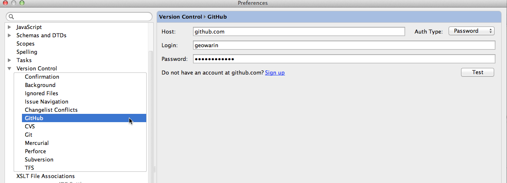
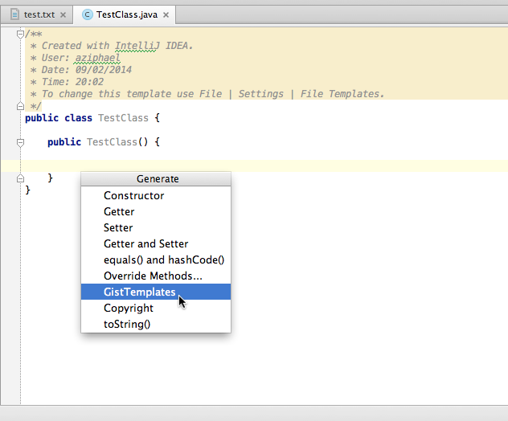
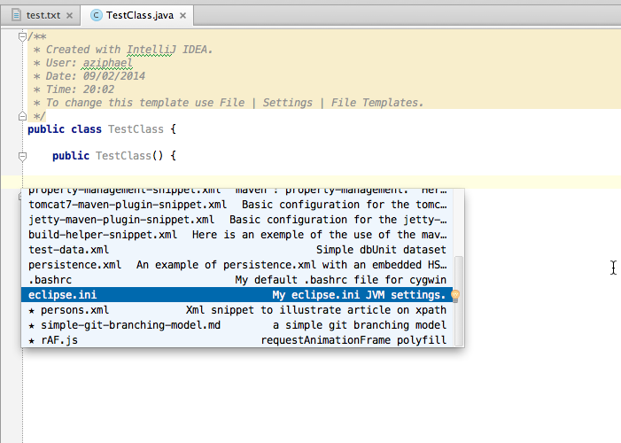

# Gist Templates IntelliJ Plugin

A plugin to use your gists as live templates !
[http://geowarin.github.io/gist-templates-plugin/](http://geowarin.github.io/gist-templates-plugin/)

## Installation

The plugin is available in `browse repositories` in intellij plugins
[http://plugins.jetbrains.com/plugin/7400](http://plugins.jetbrains.com/plugin/7400)

## Usage

1. Configure your github account in intellij

2. Allow the plugin to use your github identification

3. The gist templates appear in the code > generate menu

## Change log

* v0.11 : Support for intellij 11 to 13
* v0.1 : basic support for user's github account and his favorites

## Road Map

* Support file type for smarter propositions
* Support variables in templates
* Support multiple files gists
* Assist user when creating a template from the IDE
* Smart reload